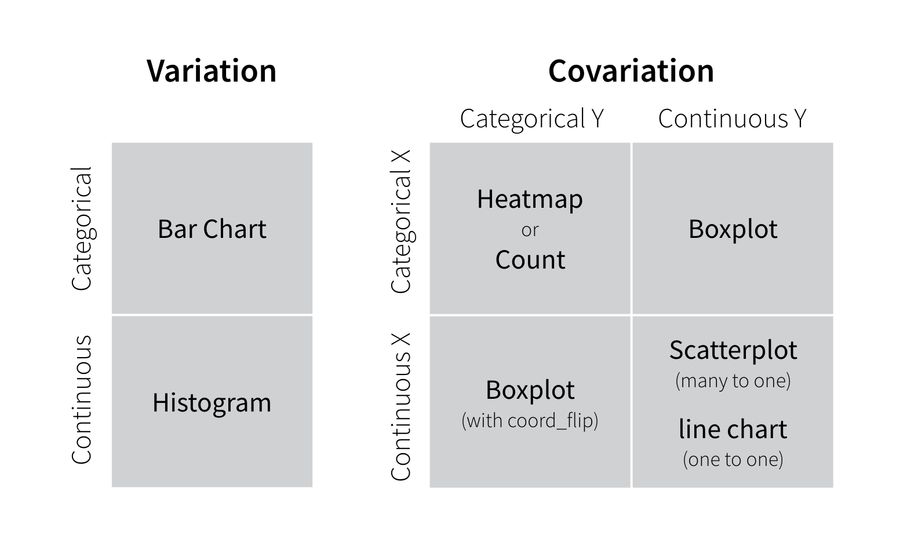

## Course Contents {-}

1. 2022.12.07: Introduction: About the course [lead by TK]
    - An introduction to open and public data, and data science
2. 2022-12-14: Exploratory Data Analysis (EDA) 1 [lead by hs]  
    - R Basics with RStudio and/or RStudio.cloud; Toy Data
3. 2022-12-21: Exploratory Data Analysis (EDA) 2 [lead by hs]   
    - R Markdown, `tidyverse` I: `dplyr`; `gapminder`
4. **2023-01-11: Exploratory Data Analysis (EDA) 3 [lead by hs]**
    - `tidyverse` II: `readr`, `ggplot2`; Public Data, WDI, WIR, etc
5. 2023-01-18: Exploratory Data Analysis (EDA) 4 [lead by hs]  
    - `tidyverse` III: `tidyr`, etc.; WDI, WIR, etc
6. 2023-01-25: Exploratory Data Analysis (EDA) 5 [lead by hs]  
    - `tidyverse` IV; WDI, WIR, etc
7. 2023-02-01: Introduction to PPDAC         
    - Problem-Plan-Data-Analysis-Conclusion Cycle: [lead by TK]
8. 2023-02-08: Model building I [lead by TK]    
    - Collecting and visualizing data and Introduction to WDI  
         (World Development Indicators by World Bank)
9. 2023-02-15: Model building II [lead by TK]    
    - Analyzing data and communications
10. 2023-02-22: Project Presentation


# Exploratory Data Analysis (EDA) I


# Exploratory Data Analysis II


# Exploratory Data Analysis III  

## Importing Public Data, WDI

### Reviews and Previews

```{r message=FALSE}
library(tidyverse)
library(gapminder)
library(maps)
library(WDI)
library(readxl)
library(ggrepel)
```

* We have used `tidyverse` and `gapminder` already.
* If you have not installed `WDI`, install it.
* We will not use `ggrepel` but if you want to use it, install it.
* `maps` and `readxl` are bundled in `tidyverse` but need to be attached by `library`.

---

#### Gapminder Package Data

```{r}
df <- gapminder
df
```

---

#### `gdpPercap` of ASEAN countries

```{r eval=FALSE}
asean <- c("Brunei", "Cambodia", "Laos", "Myanmar", 
           "Philippines", "Indonesia", "Malaysia", "Singapore")
df %>% filter(country %in% asean) %>%
  ggplot(aes(x = year, y = gdpPercap, col = country)) + geom_line()
```

---

```{r echo=FALSE}
asean <- c("Cambodia", "Myanmar", 
           "Philippines", "Indonesia", "Malaysia", "Singapore")
df %>% filter(country %in% asean) %>%
  ggplot(aes(x = year, y = gdpPercap, col = country)) + geom_line()
```


---

```{r echo=TRUE}
df %>% filter(country %in% asean) %>%
  ggplot(aes(x = gdpPercap, y = lifeExp, col = country)) + geom_point()
```

---

```{r echo=TRUE}
df %>% filter(country %in% asean) %>%
  ggplot(aes(x = gdpPercap, y = lifeExp, col = country)) + 
  geom_point() + coord_trans(x = "log10", y = "identity")
```

$\log_{10}{100}$ = `r log10(100)`, $\log_{10}{1000}$ = `r log10(1000)`, $\log_{10}{10000}$ = `r log10(10000)`

<!-- $10^{2.5}$ = `r sqrt(10)^{5}`, $10^{3}$ = `r 10^{3}`, $10^{3.5}$ = `r sqrt(10)^7`,  -->

<!-- $10^{4}$ = `r 10^4`, $10^{4.5}$ = `r sqrt(10)^9`. -->

---

```{r gapminder-combined, eval=FALSE}
library(ggrepel)
df2007 <- df %>% filter(country %in% asean, year == 2007)
df %>% filter(country %in% asean) %>%
  ggplot(aes(x = gdpPercap, y = lifeExp, col = country))+ 
  geom_line() + geom_label_repel(data = df2007, aes(label = country)) + geom_point()  +
  coord_trans(x = "log10", y = "identity") +
  theme(axis.text.x = element_text(angle = 90, vjust = 1, hjust=1), legend.position = "none") +
  labs(title = "Life Expectancy vs GDP Per Capita of ASEAN Countries",
       subtitle = "Data: gapminder package", x = "GDP per Capita", y = "Life Expectancy")
```

---


```{r echo=FALSE}
library(ggrepel)
df2007 <- df %>% filter(country %in% asean, year == 2007)
df %>% filter(country %in% asean) %>%
  ggplot(aes(x = gdpPercap, y = lifeExp, col = country))+ 
  geom_line() + geom_label_repel(data = df2007, aes(label = country)) + geom_point()  +
  coord_trans(x = "log10", y = "identity") +
  theme(axis.text.x = element_text(angle = 90, vjust = 1, hjust=1), legend.position = "none") +
  labs(title = "Life Expectancy vs GDP Per Capita of ASEAN Countries",
       subtitle = "Data: gapminder package", x = "GDP per Capita", y = "Life Expectancy")
```

---


```{r echo=FALSE}
library(tidyverse)
library(maps)
world_map <- map_data("world")
df %>%
  ggplot(aes(map_id = country)) + 
  geom_map(aes(fill = gdpPercap), map = world_map) + expand_limits(x = world_map$long, y = world_map$lat) +
  labs(title = "Gapminder Package Data", subtitle="World Map of GDP per Capita Data")
```

---

#### World Bank: World Development Indicators (WDI)

* SP.DYN.LE00.IN: Life expectancy at birth, total (years)
* NY.GDP.PCAP.KD: GDP per capita (constant 2015 US$)
* SP.POP.TOTL: Population, total

```{r cash=TRUE, eval=FALSE}
df_wdi <- WDI(
  country = "all", 
  indicator = c(lifeExp = "SP.DYN.LE00.IN", pop = "SP.POP.TOTL", gdpPercap = "NY.GDP.PCAP.KD")
)
```

```{r echo=FALSE, message=FALSE, eval=FALSE}
write_csv(df_wdi, "data/df_wdi.csv")
```

```{r echo=FALSE, message=FALSE}
df_wdi <- read_csv("data/df_wdi.csv")
```


---

```{r}
df_wdi
```

---

```{r cash=TRUE, eval=FALSE}
df_wdi_extra <- WDI(
  country = "all", 
  indicator = c(lifeExp = "SP.DYN.LE00.IN", pop = "SP.POP.TOTL", gdpPercap = "NY.GDP.PCAP.KD"), 
  extra = TRUE
)
```

```{r echo=FALSE, message=FALSE, eval=FALSE}
write_csv(df_wdi_extra, "data/df_wdi_extra.csv")
```

```{r echo=FALSE, message=FALSE}
df_wdi_extra <- read_csv("data/df_wdi_extra.csv")
```


---

```{r}
df_wdi_extra
```


---

### Exploratory Data Analysis

#### What is EDA (Posit Primers: [Visualise Data](https://posit.cloud/learn/primers/3.1))

1. EDA is an iterative cycle that helps you understand what your data says. When you do EDA, you:

2. Generate questions about your data

3. Search for answers by visualising, transforming, and/or modeling your data

Use what you learn to refine your questions and/or generate new questions

EDA is an important part of any data analysis. You can use EDA to make discoveries about the world; or you can use EDA to ensure the quality of your data, asking questions about whether the data meets your standards or not.

---

### Open and Public Data, World Bank

#### [Open Government Data Toolkit](http://opendatatoolkit.worldbank.org): [Open Data Defined](http://opendatatoolkit.worldbank.org/en/essentials.html)

The term **Open Data** has a very precise meaning. Data or content is open if anyone is free to use, re-use or redistribute it, subject at most to measures that preserve provenance and openness.

1. The data must be _legally open_, which means they must be placed in the public domain or under liberal terms of use with minimal restrictions.
2. The data must be _technically open_, which means they must be published in electronic formats that are machine readable and non-proprietary, so that anyone can access and use the data using common, freely available software tools. Data must also be publicly available and accessible on a public server, without password or firewall restrictions. To make Open Data easier to find, most organizations create and manage Open Data catalogs.

---

### World Bank: WDI - World Development Indicaters

* World Bank: https://www.worldbank.org
* [Who we are](https://www.worldbank.org/en/who-we-are):
  - To end extreme poverty: By reducing the share of the global population that lives in extreme poverty to 3 percent by 2030.
  - To promote shared prosperity: By increasing the incomes of the poorest 40 percent of people in every country. 
* World Bank Open Data: https://data.worldbank.org
  - Data Bank, World Development Indicators, etc.
* [World Development Indicators (WDI)](https://datatopics.worldbank.org/world-development-indicators/) : the World Bank’s premier compilation of cross-country comparable data on development; 1400 time series indicators
  - Themes: Poverty and Inequality, People, Environment, Economy, States and Markets, Global Links
  - Open Data & DataBank: Explore data, Query database
  - Bulk Download: Excel, CSV
  - API Documentation
  
---

### R Package [WDI](https://CRAN.R-project.org/package=WDI)

* [WDI](https://CRAN.R-project.org/package=WDI): World Development Indicators and Other World Bank Data
* Search and download data from over 40 databases hosted by the World Bank, including the World Development Indicators ('WDI'), International Debt Statistics, Doing Business, Human Capital Index, and Sub-national Poverty indicators.
* Version: 2.7.4
* Materials:	[README](https://cran.r-project.org/web/packages/WDI/readme/README.html)   - _usage_
  - [NEWS](https://cran.r-project.org/web/packages/WDI/news/news.html) - _version history_
* Published: 2021-04-06
* README: https://cran.r-project.org/web/packages/WDI/readme/README.html
* Reference manual:	[WDI.pdf](https://cran.r-project.org/web/packages/WDI/WDI.pdf)

---

### Function WDI

* **Usage**

```
WDI(country = "all",
    indicator = "NY.GDP.PCAP.KD",
    start = 1960,
    end = 2020,
    extra = FALSE,
    cache = NULL)
```

* **Arguments** See Help!
  - country: Vector of countries (ISO-2 character codes, e.g. "BR", "US", "CA", or "all") 
  - indicator: If you supply a named vector, the indicators will be automatically renamed: `c('women_private_sector' = 'BI.PWK.PRVS.FE.ZS')`

---

### Function WDIsearch

```{r}
library(WDI)
```
```{r}
WDIsearch(string = "NY.GDP.PCAP.KD", 
          field = "indicator", cache = NULL)
```

---

```{r}
WDIsearch(string = "population", 
          field = "name", short=FALSE, cache = NULL)
```

---

```
WDIsearch(string = "NY.GDP.PCAP.KD", 
  field = "indicator", short = FALSE, cache = NULL)
```
```
WDIsearch(string = "gdp", 
  field = "name", short = TRUE, cache = NULL) 
```

---

### Bulk Downloads at WDI site

WDIbulk downloads the zip file of Bulk Downloads in [WDI site](https://datatopics.worldbank.org/world-development-indicators/) , it is a list containing 6 data frames: Data, Country, Series, Country-Series, Series-Time, FootNote.

---

### WDIcache

Download an updated list of available WDI indicators from the World Bank website. Returns a list for use in the WDIsearch function.

```{r widcache, cash=TRUE, eval=FALSE}
wdi_cache <- WDIcache()
```

Downloading all series information from the World Bank website can take time. The WDI package ships with a local data object with information on all the series available on 2012-06-18. You can update this database by retrieving a new list using `WDIcache`, and then feeding the resulting object to `WDIsearch` via the cache argument.

```{r echo=FALSE, message=FALSE, eval=FALSE}
write_rds(wdi_cache, "data/wdi_cache.RData", refhook = NULL)
```

```{r echo=FALSE, message=FALSE, eval=FALSE}
wdi_cache <- read_rds("data/wdi_cache.RData", refhook = NULL)
```


---

```{r eval=FALSE}
wdi_cache
```


---

### WDI_data

List of 2 data frames

The first character matrix includes a full list of WDI series. This list is updated semi-regularly. Users can refresh the list manually using the 'WDIcache()' function and search in the updated list using the 'cache' argument.


<!-- ```{r} -->
<!-- glimpse(WDI_data) -->
<!-- ``` -->

<!-- --- -->

<!-- ```{r} -->
<!-- WDI_data$series -->
<!-- ``` -->

<!-- --- -->

<!-- ```{r} -->
<!-- WDI_data$country -->
<!-- ``` -->

```{r}
WDI_data$country  %>% filter(country == "Japan")
```

---

```{r}
WDIsearch(string = "gdp", 
  field = "name", short = FALSE, cache = NULL) #cache = wdi_cache
```

---

### World Development Indicators - Summary

Find indicators:

1. `WDIsearch(string = "gdp", field = "name", short = FALSE, cache = NULL)`
  - `WDIsearch(string = "gdp", field = "name", short = FALSE, cache = wdi_cache)`
  - `WDIsearch(string = "NY.GDP.PCAP.KD", field = "indicator", short = FALSE, cache = NULL)`
2. [WDI](https://datatopics.worldbank.org/world-development-indicators/): Data Themes
3. Browse by Indicators: https://data.worldbank.org/indicator
   - Featured Indicators or All Indicators
   - Obtain the indicator from the detail or the URL

---

#### Example: CO2 emissions (metric tons per capita)

* ID: EN.ATM.CO2E.PC
* URL: https://data.worldbank.org/indicator/EN.ATM.CO2E.PC

```{r}
WDIsearch(string = "EN.ATM.CO2E.PC", field = "indicator", 
          short = FALSE, cache = NULL) #cache = wdi_cache
```

```{r}
WDIsearch(string = "EN.ATM.CO2E.PC", field = "indicator", 
          short = FALSE, cache = NULL) %>% pull(description) #cache = wdi_cache
```

* Source: Climate Watch. 2020. GHG Emissions. Washington, DC: World Resources Institute. Available at: climatewatchdata.org/ghg-emissions. See SP.POP.TOTL for the denominator's source.


---

```{r cash=TRUE, eval=FALSE}
co2pcap <- WDI(country = "all", indicator = "EN.ATM.CO2E.PC", start = 1960, end = NULL, extra = TRUE, cache = NULL) #cache = wdi_cache
```

```{r echo=FALSE, message=FALSE, eval=FALSE}
write_csv(co2pcap, "data/co2pcap.csv")
```

```{r echo=FALSE, message=FALSE}
co2pcap <- read_csv("data/co2pcap.csv")
```

```{r}
co2pcap
```


---

```{r}
write_csv(co2pcap, "data/co2pcap.csv")
```


---

```{r}
co2pcap %>% filter(country %in% c("World", "Japan", "United States", "China")) %>%
  ggplot(aes(x = year, y = EN.ATM.CO2E.PC, color = country)) + 
  geom_line()
```

---

```{r}
co2pcap %>% filter(!is.na(EN.ATM.CO2E.PC)) %>% pull(year) %>% summary()
```


---

```{r}
co2pcap %>% 
  filter(country %in% c("World", "Japan", "United States", "China"), year %in% 1990:2019) %>%
  ggplot(aes(x = year, y = EN.ATM.CO2E.PC, color = country)) + 
  geom_line()
```

---

```{r}
co2pcap %>% 
  filter(income != "Aggregates", year == 2019) %>%
  ggplot(aes(x = income, y = EN.ATM.CO2E.PC, fill = income)) + 
  geom_boxplot()
```

---

```{r}
co2pcap %>% 
  filter(income != "Aggregates", year == 2019, !is.na(EN.ATM.CO2E.PC)) %>%
  ggplot(aes(x = income, y = EN.ATM.CO2E.PC, fill = income)) + 
  geom_boxplot()
```

* What is `boxplot`: https://vimeo.com/222358034

---

```{r}
co2pcap %>% 
  filter(income != "Aggregates", year == 2019, !is.na(EN.ATM.CO2E.PC)) %>%
  group_by(income) %>%
  summarize(min = min(EN.ATM.CO2E.PC), med = median(EN.ATM.CO2E.PC), max = max(EN.ATM.CO2E.PC), IQR = IQR(EN.ATM.CO2E.PC), n = n())
```

---
```{r}
co2pcap %>% 
  filter(income != "Aggregates", year == 2019, !is.na(EN.ATM.CO2E.PC)) %>%
  filter(!income %in% c("High income", "Low income", "Lower middle income", "Upper middle income"))
```

```{r}
co2pcap %>% 
  filter(income != "Aggregates", year == 2019) %>%
  filter(income == "Not classified")
```

---

```{r echo=TRUE, eval=FALSE}
co2pcap %>% 
  filter(income != "Aggregates", year == 2019) %>%
  ggplot(aes(map_id = country)) + 
  geom_map(aes(fill = income), map = world_map) + expand_limits(x = world_map$long, y = world_map$lat) +
  labs(title = "Income Levels in 2019")
```
---

```{r echo=FALSE}
co2pcap %>% 
  filter(income != "Aggregates", year == 2019) %>%
  ggplot(aes(map_id = country)) + 
  geom_map(aes(fill = income), map = world_map) + expand_limits(x = world_map$long, y = world_map$lat) +
  labs(title = "Income Levels in 2019")
```

---

```{r}
co2pcap %>% distinct(country)
```

---

```{r}
world_map %>% distinct(region)
```

---

```{r}
world_map0 <- world_map %>% 
  mutate(region = case_when(region == "Macedonia" ~ "North Macedonia",
                            region == "Ivory Coast"  ~ "Cote d'Ivoire",
                            region == "Democratic Republic of the Congo"  ~ "Congo, Dem. Rep.",
                            region == "Republic of Congo" ~  "Congo, Rep.",
                            region == "UK" ~  "United Kingdom",
                            region == "USA" ~  "United States",
                            region == "Laos" ~  "Lao PDR",
                            region == "Slovakia" ~  "Slovak Republic",
                            region == "Saint Lucia" ~  "St. Lucia",
                            region == "Kyrgyzstan"  ~  "Kyrgyz Republic",
                            region == "Micronesia" ~ "Micronesia, Fed. Sts.",
                            region == "Swaziland"  ~ "Eswatini", 
                            region == "Virgin Islands"  ~ "Virgin Islands (U.S.)", 
                            region == "Russia" ~ "Russian Federation", 
                            region == "Egypt" ~ "Egypt, Arab Rep.",
                            region == "South Korea" ~ "Korea, Rep.",
                            region == "North Korea" ~ "Korea, Dem. People's Rep.",
                            region == "Iran" ~ "Iran, Islamic Rep.",
                            region == "Brunei" ~ "Brunei Darussalam",
                            region == "Venezuela" ~ "Venezuela, RB",
                            region == "Yemen" ~ "Yemen, Rep.",
                            region == "Bahamas" ~ "Bahamas, The",
                            region == "Syria" ~ "Syrian Arab Republic",
                            region == "Turkey" ~ "Turkiye",
                            region == "Cape Verde" ~ "Cabo Verde",
                            region == "Gambia" ~ "Gambia, The",
                            region == "Czech Republic" ~ "Czechia",
                            TRUE ~ region))
```

---

```{r}
write_csv(world_map0, "data/world_map0.csv")
```

```{r eval=FALSE}
map0_url <- "https://icu-hsuzuki.github.io/da4r2022_note/data/world_map0.csv"
world_map0 <- read_csv(map0_url)
```


---

```{r}
co2pcap %>% filter(income != "Aggregates", year == 2019) %>% 
  anti_join(world_map0, by = c("country"="region"))
```

---

```{r}
world_map0 %>% anti_join(co2pcap, by = c("region"="country")) %>% distinct(region) %>% arrange(region)
```

---


```{r}
world_map0 %>% left_join(iso3166, by = c("region" = "ISOname")) %>%
  filter(is.na(a2)) %>% distinct(region)
```


---


```{r echo=FALSE}
co2pcap %>% 
  filter(income != "Aggregates", year == 2019) %>%
  ggplot(aes(map_id = country)) + 
  geom_map(aes(fill = income), map = world_map0) + expand_limits(x = world_map$long, y = world_map$lat) +
  labs(title = "Income Levels in 2019")
```


## Data Visualization and `ggplot2'


### Learning Resouces

* Posit Primers:
  - [Visualize Data](https://posit.cloud/learn/primers/3): Learn how to use ggplot2 to make any type of plot with your data. Then learn the best ways to visualize patterns within values and relationships between variables.
* [r4ds: Data Visualization](https://r4ds.had.co.nz/data-visualisation.html#data-visualisation)

---

### Exploratory Data Analysis

#### What is EDA?

EDA is an iterative cycle that helps you understand what your data says. When you do EDA, you:

1. Generate questions about your data

2. Search for answers by visualising, transforming, and/or modeling your data

3. Use what you learn to refine your questions and/or generate new questions

EDA is an important part of any data analysis. You can use EDA to make discoveries about the world; or you can use EDA to ensure the quality of your data, asking questions about whether the data meets your standards or not.

---

#### Two useful questions

There is no rule about which questions you should ask to guide your research. However, two types of questions will always be useful for making discoveries within your data. You can loosely word these questions as:

1. What type of variation occurs within my variables?
2. What type of covariation occurs between my variables?

The rest of this tutorial will look at these two questions. To make the discussion easier, let’s define some terms…

---

### Data Visualization

### `ggplot2` Basics

{width=75%}


---

### Example: World Inequility Report - WIR2022

* World Inequality Report: https://wir2022.wid.world/
* Executive Summary: https://wir2022.wid.world/executive-summary/
* Methodology: https://wir2022.wid.world/methodology/
* Data URL: https://wir2022.wid.world/www-site/uploads/2022/03/WIR2022TablesFigures-Summary.xlsx

```{r}
library(readxl)
```

```{r summary-data, cash = TRUE, eval = FALSE}
url_summary <- "https://wir2022.wid.world/www-site/uploads/2022/03/WIR2022TablesFigures-Summary.xlsx"
download.file(url = url_summary, destfile = "data/WIR2022s.xlsx") 
excel_sheets("data/WIR2022s.xlsx")
```

### F14: Global carbon inequality, 2019. Group contribution to world emissions (%)

Note that the sheet name of F14 has period at the end. 

```{r data-f14, cash = TRUE}
df_f14 <- read_excel("data/WIR2022s.xlsx", sheet = "data-F14.")
df_f14
```

* `\n` for line break in the title.

---

#### Categorical vs Continuous Value

```{r}
df_f14 %>% 
  ggplot(aes(x = Group, y = Share)) +
  geom_col()
```

---

```{r}
df_f14 %>% 
  ggplot(aes(x = Group, y = Share)) +
  geom_col(width = 0.5, fill = scales::hue_pal()(1)[1]) + 
  scale_y_continuous(labels = scales::percent_format(accuracy = 1)) +
  labs(title = "Figure 14. Global carbon inequality, \n2019 Group contribution to world emissions (%)", 
       x = "", y = "Share of world emissions (%)")
```

---

#### Memo

* `width = 0.5`: width of bars
* `fill = scales::hue_pal()(1)[1])`: hue scale
  - https://ggplot2.tidyverse.org/reference/scale_hue.html.
* `scale_y_continuous(labels = scales::percent_format(accuracy = 1))`: percent format
  - if accuracy = 0.1, we have 10.0% etc.
* `labs(title = "Figure 14. Global carbon inequality, \n2019 Group contribution to world emissions (%)",
   x = "", y = "Share of world emissions (%)")`
  - title = "": `\n` is for line feed
  - x, y: labels of x-axis and y-axis

---

### F12: Female share in global labor incomes, 1990-2020

```{r data-f12, cash = TRUE}
df_f12 <- read_excel("data/WIR2022s.xlsx", sheet = "data-F12")
df_f12
```

---

```{r}
df_f12 %>% 
  select(year = "Data needs to be updated", value = ...2) %>%
  filter(!is.na(year)) %>%
  ggplot(aes(x = year, y = value)) +
  geom_col(width = 0.5, fill = scales::hue_pal()(2)[2])
```

---

```{r}
df_f12 %>% 
  select(year = "Data needs to be updated", value = ...2) %>%
  filter(!is.na(year)) %>%
  ggplot(aes(x = year, y = value)) +
  geom_col(width = 0.5, fill = scales::hue_pal()(2)[2]) +
  geom_hline(yintercept = 0.5, linetype = 2, colour = scales::hue_pal()(2)[1]) +
  scale_y_continuous(labels = scales::percent_format(accuracy = 1)) +
  labs(title = "Figure 12. Female share in global labor incomes, 1990-2020", 
        x = "", y = "") +
  annotate("text", x = 1, y = 0.48, label = "Gender parity", size = 3) +
  annotate("text", x = 5.2, y = 0.47, label = stringr::str_wrap("Women make only 35% of global labor incomes, men make the remaining  65%.", width = 40), size = 3)
```


### F1: Global income and wealth inequality, 2021

```{r data-f1, cash = TRUE}
df_f1 <- read_excel("data/WIR2022s.xlsx", sheet = "data-F1")
df_f1
```

---

```{r echo=FALSE}
df_f1_rev <- df_f1 %>% select(cat = ...1, 2:4) %>%
  pivot_longer(2:4, names_to = "group", values_to = "value")
df_f1_rev
```

```{r}
df_f1_rev %>%
  ggplot(aes(x = cat, y = value, fill = group)) +
  geom_col(position = "dodge")
```

---

### References of `ggplot2`

* Textbook: [R for Data Science, Data Visualization](https://r4ds.had.co.nz/data-visualisation.html#data-visualisation)

#### RStudio Primers: See References in Moodle at the bottom

**Visualize Data**

  - Exploratory Data Analysis
  - Bar Charts
  - Histograms
  - Boxplots and Counts
  - Scatterplots
  - Line Plots
  - Overplotting and Big Data
  - Customize Your Plots


## The Week Three Assignment (in Moodle)

**WDI and `ggplot2`**

* Create an R Notebook of a Data Analysis containing the following and submit the rendered HTML file (eg. `a3_123456.nb.html`  by replacing 123456 with your ID)
  1. create an R Notebook using the R Notebook Template in Moodle,  save as `a3_123456.Rmd`, 
  2. write your name and ID and the contents, 
  3. run each code block, 
  4. preview to create `a3_123456.nb.html`,
  5. submit  `a3_123456.nb.html` to Moodle.

1. Choose at least one indicator of WDI

    - Information of the data: Name, Indicator, Description, Source, etc.
    - Download the data with `WDI`
    - Explain why you chose the indicator
    - List questions you want to study

---

2. Explore the data using visualization using `ggplot2`

    - Use a histogram (geom_histogram), boxplot (geom_boxplot), a scatter plot (geom_point), a line plot (geom_line)
    - For at least one chart, add title, and labels of axis, and add an explanation of it

3. Observations and difficulties encountered.

**Due:** 2023-01-16 23:59:00. Submit your R Notebook file in Moodle (The Third Assignment). Due on Monday!


